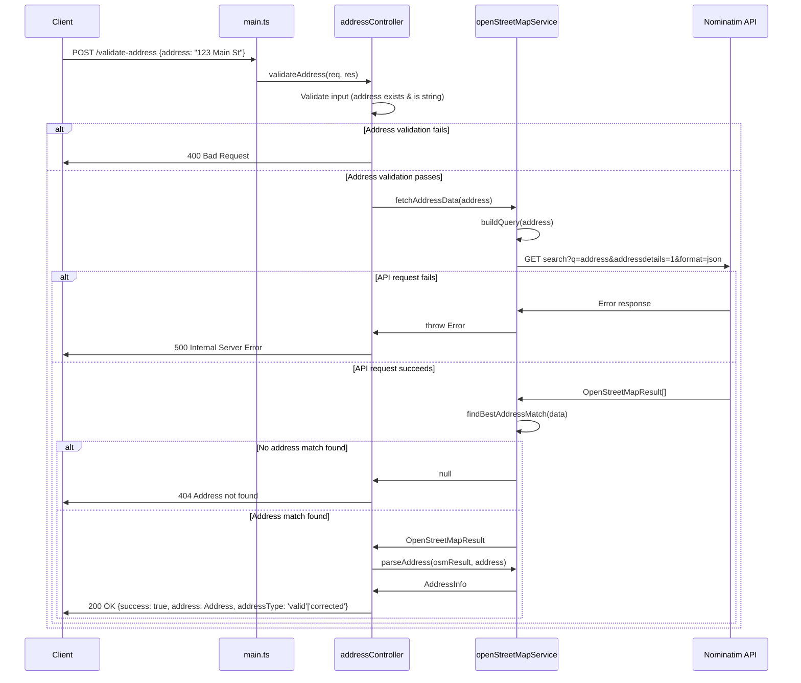

# Addressify

Your address validation and parsing service.

## Running Locally

The most straightforward way to run Addressify locally is by using Docker. Assuming you have both [Docker](https://docs.docker.com/get-docker/) and [Docker Compose](https://docs.docker.com/compose/install/) installed, you can run Addressify with the following commands:

```bash
$ docker-compose up -d
```

As an alternative, it can be run via [yarn](https://yarnpkg.com/) with the following commands:

```bash
$ yarn install
$ yarn start:dev
```

This will start the Addressify service in the background. You can access the service at `http://localhost:8080`. Using the HTTP client of your choice, you can send a POST request to the `/validate-address` endpoint with a JSON payload containing an `address` field. This can be done using [httpie](https://httpie.io/) via the following command:

```bash
$ http http://localhost:8080/validate-address address="1600 Amphitheatre Parkway, Mountain View, CA"

> HTTP/1.1 200 OK
>  Connection: keep-alive
>  Content-Length: 156
>  Content-Type: application/json; charset=utf-8
>  Date: Sat, 26 Jul 2025 23:09:33 GMT
>  ETag: W/"9c-RhdDoFWGf9A3GEDv9NIJT6btJXM"
>  Keep-Alive: timeout=5
>  X-Powered-By: Express
>
>  {
>      "address": {
>          "city": "Mountain View",
>          "number": 1600,
>          "state": "California",
>          "street": "Amphitheatre Parkway",
>          "zip": 94043
>      },
>      "addressType": "corrected",
>      "success": true
>  }
>
```

## Design

Addressify works by exposing a single `/validate-address` endpoint which accepts a JSON payload with an `address` field. It relies on OpenStreetMap data as its source of truth for address validation and parsing.

### Possible Return Status Codes and Data

| Status Code | Description                                | Data                                                                        |
| ----------- | ------------------------------------------ | --------------------------------------------------------------------------- |
| 200         | Address is valid and parsed successfully   | `{street: "Main St", houseNumber: "123", city: "New York", country: "USA"}` |
| 400         | Invalid input (missing or invalid address) | `{ error: message }`                                                        |
| 404         | Address not found in OpenStreetMap         | `{ error: message }`                                                        |
| 500         | Internal server error                      | `{ error: message }`                                                        |

## Architecture Decisions

Address Validation is a complex problem due to its virtually infinite variable space and. A deterministic solution hasn't been found yet due to the variety and inconsistency of address information. Therefore it's a very good use case for Natural Language Processing (NLP) techniques.

The most sophisticated approach for validating and structuring data involves combining NLP techniques for input validation and GeoData lookup for address validation. Training a dedicated model or populating a database with address data isn't a viable approach due to time constraints.

[OpenStreetMap's Nominatim](https://nominatim.org/) is a public API which combines both and provide a robust and reliable service we can use.

This project uses [express js](https://expressjs.com/) to build its API layer for simplicity and queries [Nominatim](https://nominatim.org/) with node fetch.

- Good use-case for NLP
- Not training a model for it
- Using a library
- The most robust option was libpostal
- Handles most of the complex use-cases
- Uses a third-party library for parsing and validation

### Address Validation Flow

The main endpoint exposed by our API is `/validate-address`, which implements the following algorithm to treat and validate input as well as communicating with Nominatim API, structuring data, handling errors and returning a response.



## Usage of AI

AI has been used via Zed Editor for the following purposes:

- Generation of Tests - LLMs are particularly good at text processing, meaning we can leverage them to write unit tests very quickly by providing prompts describing what the tests should validate.
- Generation of Docker configuration - Docker is one of the most popular solutions for containerization, meaning market LLMs will have a lot of context on it. It's been used to build the Docker image and docker-compose configuration making it easier to run and deploy on different machines.
- Autogeneration of type declaration boilerplate: the Nominatim API returns data in a parameterized and very predictable format, making it easy to generate type declarations for the response although time-consuming. NLP has been used to generate this type declaration.
